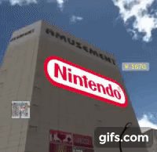

# TraVR

A COVID-inspired project

TraVR provides a realistic alternative experience to conventional travelling by preserving its cultural and social aspects - ultimately, this will promote real-world tourism by allowing people to immerse themselves in a low-cost exploration of different cities.

## Demo

